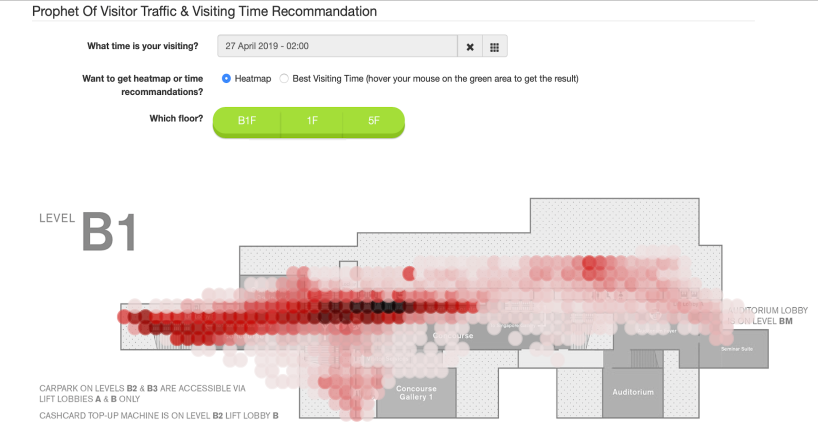

## Dependencies
Python Packages: *Tensorflow*, *Numpy*, *Pandas*
 
Web tech: *D3.js*, *bootstrap*

## Report: 
See [Final Report](docs/report/FinalReport_Fordifficulty.pdf),
[Final Slides](docs/report/ForDifficulty-FinalPresentation.pdf)

## Demo
**Visitor Distribution Prediction**

**Best Visit Time Suggestion**

## Code
Data are provided by Kiana Inc. and are not open.

**Preprocessing Scripts:** [src/prestep](src/prestep)

**Model Scripts:** [src/model](src/model)

**Web Application:** [web](web)

*Enter the "web" path, run the command to start web app:*

`browser-sync start -s -f "*.html,*.css,*.js"-i index.html`

**Debugger Dataset:**

*input/debugger_origin.csv* file is small subset from origin dataset (random sampling). It is used for testing the execution of our preprocessing programs.

*input/debugger.csv* file is a small dataset used to debug programs and test website interface. It should not be regarded as formally implemented data. It contains counts of records in each block.
* Time period is in: **10:00 to 14:45** *and* **April 25 to April 30th**.
* Cols: Level, latBlock, lngBlock, month, day, hour, quarter, count

*input/weather* contains weather data scraped from internet

**Overview of Functions:**

A quick overview of preprocessing program is in *[Quick_Overview.ipynb](./Quick_Overview.ipynb)* which runs on debugger dataset.

## Support
INF-560 (Data Informatics Professional Practicum) Project sponsored by Kiana Analytics, Inc.

Team members: Yuhan Wang, Tianyang Li, Rui Lin, Jing Zhang

Contact: yuhanwg1996@gmail.com
