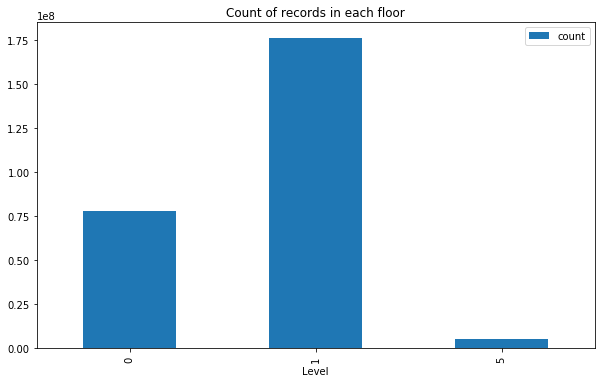
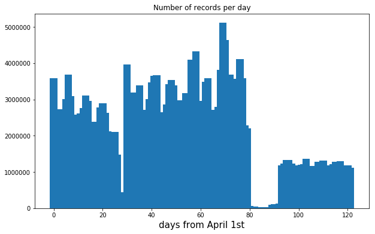
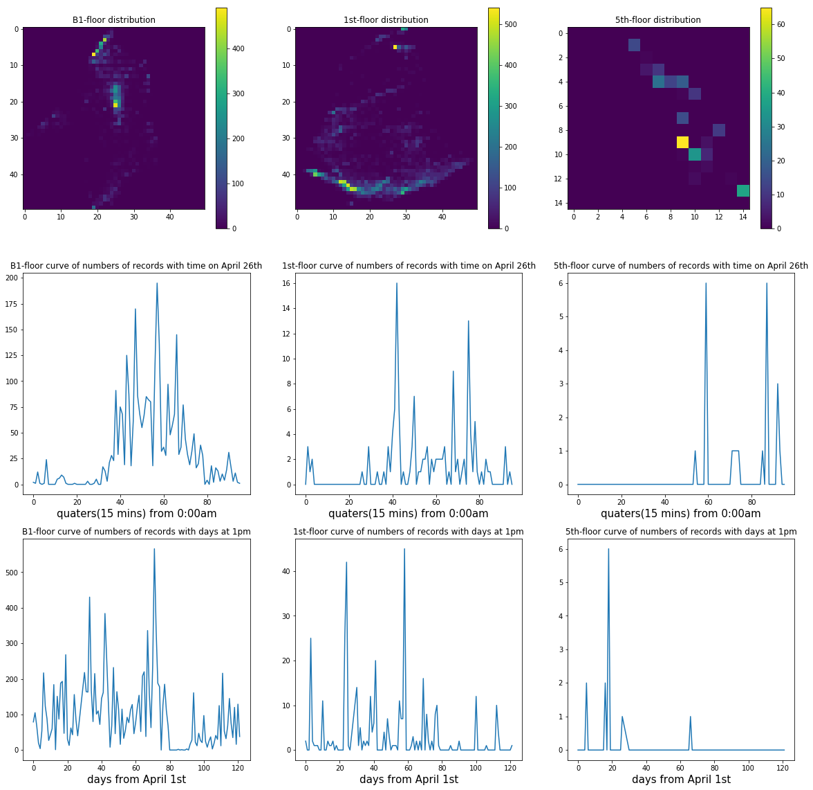
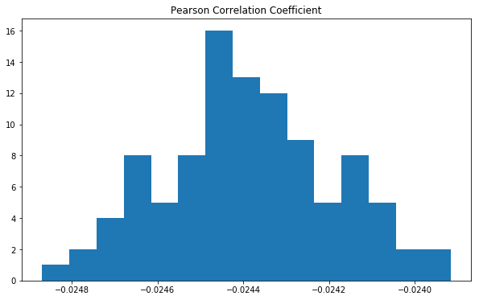
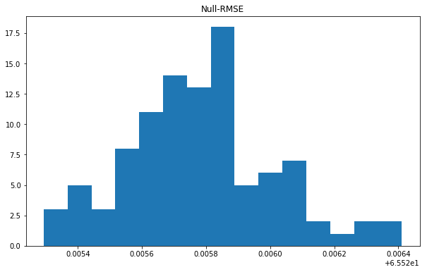

The number of data points in each level is presented in below:

In which it's clear that there are only few records on fifth level. When dividing areas into blocks, it's necessary to maintain the block size, number of visitors in the block, above certain threshold. Low block capacity will lead to much noise and sparse distribution.

In this perspective, it's reasonable to divide fifth level area into 15*15 blocks, while B1 and first level areas are divided to 50*50 blocks respectively. This division can ensure more than half of blocks are not empty. Still, the block divisions in this stage are just baseline parameters. Detailed parameter tuning on block division as well as time division will be implemented in improvement stage.

The curve of numbers of records with respect to days from April 1st to July 31st is presented:

As it indicates, there are few records from Jun 20th and July 1st. There may be some specific reasons like that the gallery was closed or the data are missing. This part of data should be dropped during model training.

The distributions of records during 13:00 to 13:15 on April 26th for each floor and the curves of number of records in certain block with time are presented below.

We can see some patterns from images, such as
* Indicated by distribution images (upper 3), visitors tend to cluster in the same blocks which may be because of some famous works.

* Indicated by curve images (middle 3), both 1st and B1 floors have most visitor traffic between 10 am and 8 pm but 5th floors have most traffic after 3pm.

* Indicated by curve images (bottom 3), most records are from first two months (April and May) while there are few records in

The second task in the pipeline is to verify if there are relationships between floors. As an example, statistical tests between records of B1 and 1st floors are implemented in this report.

Before calculation, numbers of records in B1-level blocks during different time periods are treated as X with respect to capacities of corresponding 1st-level blocks in the same time periods as Y.

First method is to calculate Pearson Correlation Coefficient of X and Y. Sampling algorithm is used to calculate the distribution of coefficients.

The coefficient has a distribution with mean of -0.0244 and std of 0.00020. It shows a weak linear correlation between X and Y.

Second method to test the relationship is constructed on permutation, inspired by the article *[Permutation importance: a corrected feature importance measure](#PermutationImportance)*. First stage is to build 10 classifiers to predict Y through X and calculate the mean RMSE. Then to build another 100 classifiers to predict randomly shuffled Y through X. The result RMSE is called null-RMSE. If values of X are informal for predicting Y, the mean RMSE in first stage should be away from distribution of null-RMSEs. Comparison of two-stage results can show whether they are correlated. Distribution of second-stage RMSE is shown below.

The distribution of null-RMSE has mean value of 65.526 and standard deviation value of 0.00023, while the mean RMSE of first-stage prediction is 65.437. The mean RMSE is out of null-RMSE distribution with nearly 400 sigmas. This result guarantees there definitely exists relationship between 1st-floor distribution and B1-floor distribution. How ever, B1-floor distribution can only explain 0.13% of 1st-floor distribution. Whether B1-floor distribution should be accounted into prediction of 1st-floor distribution should be determined by both cost and improvement in experiment stage.

<h6 id="PermutationImportance">[1] Altmann, André, et al. "Permutation importance: a corrected feature importance measure." Bioinformatics 26.10 (2010): 1340-1347.</h6>
